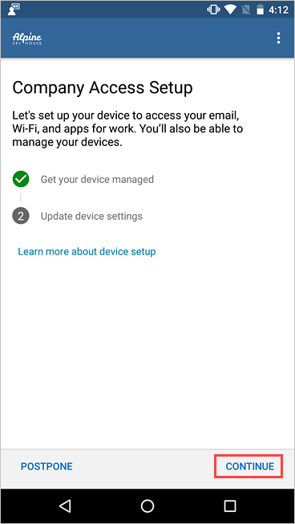

---
# required metadata

title: Enroll Android device with Intune Company Portal | Microsoft Docs
description: Describes how to enroll an Android device with Intune Company Portal
keywords:
author: lenewsad
ms.author: lanewsad
manager: dougeby
ms.date: 10/31/2019
ms.topic: article
ms.prod:
ms.service: microsoft-intune
ms.subservice: end-user
ms.technology:
ms.assetid: 0ed3a002-7533-4001-ae24-e10b64b66620
searchScope:
 - User help

# optional metadata

ROBOTS:  
#audience:
#ms.devlang:
ms.reviewer: esmich
ms.suite: ems
#ms.tgt_pltfrm:
ms.custom: intune-enduser
ms.collection: M365-identity-device-management
---

# Enroll your device with Company Portal  
Enroll your personal or corporate-owned Android device to get secure access to company email, apps, and data. Company Portal supports Android devices, including Samsung Knox, running Android 4.4 and later.  
 
> [!VIDEO https://www.youtube.com/embed/k0Q_sGLSx6o?rel=0]

> [!NOTE]
> Samsung Knox is a type of security that certain Samsung devices use for additional 
> protection outside of what native Android provides. To check if you have a Samsung Knox device,> go to **Settings** > **About device**. If you don't see **Knox version** listed there, you have a native Android device.

## Enroll device  
Make sure to [install the free Intune Company Portal app from Google Play](https://play.google.com/store/apps/details?id=com.microsoft.windowsintune.companyportal). 

During enrollment, you might be asked to choose a category that best describes how you use your device. Your company support uses your answer to check the apps that you have access to.  

1. Open the Company Portal app and sign in with your work or school account.  

2. If prompted to accept your organization's terms and conditions, tap **ACCEPT ALL**.  

     

3. The next two screens provide information about:  
    * Your data privacy: Review and then tap **CONTINUE**.  
    * Upcoming steps: Review and then tap **NEXT**.  

4. Depending on your version of Android, you might be prompted to allow access to certain parts of your device. These prompts are required by Google and not controlled by Microsoft.  

    Tap **Allow** for the following permissions:  
    * **Allow Company Portal to make and manage phone calls**: It is safe to tap **ALLOW**. Microsoft will never make or manage your phone calls.  This permission enables your device to share its international mobile station equipment identity (IMEI) number with Intune, your organization's device management provider. The IMEI number is like a serial number and uniquely identifies your mobile device.   
    * **Allow Company Portal to access your contacts**: It is safe to tap **ALLOW**. Microsoft will never access your contacts. This permission lets the Company Portal app create, use, and manage your work account.  

    If you deny permission, you'll be prompted again the next time you sign in to Company Portal. To turn off these messages, select **Never ask again**. To manage app permissions, go to the Settings app > **Apps** > **Company Portal** > **Permissions** > **Phone**.  

5. Activate the device admin app. 

    Company Portal needs device administrator permissions to securely manage your device. Activating the app lets your organization identify possible security issues, such as repeated failed attempts to unlock your device, and respond appropriately.  

      
> [!NOTE]
> Microsoft does not control the messaging on this screen. We understand that its phrasing can seem somewhat drastic. Company Portal can't specify which restrictions and access are relevant to your organization. If you have questions about how your organization uses the app, contact your IT support person. Go to the [Company Portal website](https://go.microsoft.com/fwlink/?linkid=2010980) to find your organization's contact information.  

6. Your device begins enrolling. If you're using a Samsung Knox device, you'll be prompted to review and acknowledge the ELM Agent privacy policy first.   

             

7. On the **Company Access Setup** screen, tap **CONTINUE**.  

      

8. Your organization might require you to update your device settings. Tap **RESOLVE** to adjust a setting. When you're done updating settings, tap **CONTINUE**.  

     

9. When setup is complete, tap **DONE**.    

## Next steps  

Before you try to install a school or work app, go to **Settings** > **Security**, and turn on **Unknown sources**. If you don't turn on this option, you'll see the following message when you try to install an app: "Install blocked. For security reasons, your device is set to block installations of apps obtained from unknown sources." You can tap **Settings** on the message to go directly to **Unknown sources**.  

> [!Note]
> If your organization is using telecom expense management software, you will have an additional few steps to complete before your device is fully enrolled. Find out more [here](enroll-your-device-with-telecom-expense-management-android.md).

If you get an error while you try to enroll your device in Intune, you can [email your company support](send-logs-to-your-it-admin-by-email-android.md).  

Still need help? Contact your company support (check the [Company Portal website](https://go.microsoft.com/fwlink/?linkid=2010980) for contact information), or write the <a href="mailto:wintunedroidfbk@microsoft.com?subject=I'm having trouble with enrolling my Android device&body=Describe the issue you're experiencing here.">Microsoft Android team</a>.
