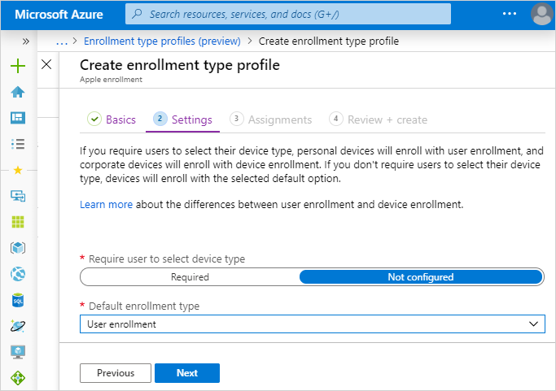

---
# required metadata

title: Enroll iOS devices - User Enrollment
titleSuffix: Microsoft Intune
description: Learn how to set up iOS and iPadOS User Enrollment.
keywords:
author: ErikjeMS
ms.author: erikje
manager: dougeby
ms.date: 10/2/2019
ms.topic: conceptual
ms.service: microsoft-intune
ms.subservice: enrollment
ms.localizationpriority: high
ms.technology:
ms.assetid: 

# optional metadata

#ROBOTS:
#audience:
#ms.devlang:
ms.reviewer: tisilver
ms.suite: ems
search.appverid: MET150
#ms.tgt_pltfrm:
ms.custom: intune-azure
ms.custom: seodec18
ms.collection: M365-identity-device-management
---

# Set up iOS and iPadOS User Enrollment (preview)

You can set up Intune to enroll iOS and iPadOS devices using Apple's User Enrollment process. User Enrollment gives admins a streamlined subset of management options compared to other enrollment methods.

For more information about the options available with User Enrollment, see [User Enrollment supported actions, passwords, and other options](ios-user-enrollment-supported-actions.md).

> [!NOTE]
> Support for Apple's User Enrollment in Intune is currently in preview.

## Prerequisites
- [Mobile Device Management (MDM) Authority](../fundamentals/mdm-authority-set.md)
- [Apple MDM Push certificate](apple-mdm-push-certificate-get.md)
- [Managed Apple IDs](https://support.apple.com/guide/apple-business-manager/mdm1c9622977/web).

## Create a User Enrollment profile in Intune

An enrollment profile defines the settings applied to a group of devices during enrollment. 

1. In the [Microsoft Endpoint Manager Admin Center](https://go.microsoft.com/fwlink/?linkid=2109431), choose **Device enrollment** > **Apple Enrollment** > **Enrollment types (preview)** > **Create profile** > **iOS**. This profile is where you’ll indicate what enrollment experience your iOS and iPadOS end users will have on devices not enrolled through a corporate Apple method. If you'd like to make changes, you can edit this profile after you've created it.

    

2. On the **Basics** page, enter a **Name** and **Description** for the profile for administrative purposes. Users don't see these details. You can use this **Name** field to create a dynamic group in Azure Active Directory. Use the profile name to define the enrollmentProfileName parameter to assign devices with this enrollment profile. Learn more about [Azure Active Directory dynamic groups](https://docs.microsoft.com/azure/active-directory/active-directory-groups-dynamic-membership-azure-portal#rules-for-devices).

    

3. Select **Next**.

4. On the **Settings** page, you can choose to give users the choice on which enrollment type they'll use. Alternately, you can set a default.

    

    - If you want all the users in this profile to use User Enrollment, follow these steps:
        1. For **Require user to select device type**, select **Not configured**.
        2. For **Default enrollment type**, select **User Enrollment**.
    - If you want all the users in this profile to use Device Enrollment, follow these steps:
        1. For **Require user to select device type**, select **Not configured**.
        2. For **Default enrollment type**, select **Device Enrollment**.
    - If you want to give all users in this group the choice of which enrollment type to use, select **Required** for **Require user to select device type**. When users enroll their devices, they'll be given the option to choose between **I own this device** and **(Company) owns this device**. If they choose the former, the device will be enrolled by using User Enrollment. If they choose the latter, the device will be enrolled by using Device Enrollment. If the user chooses **I own this device**, they'll get another option to secure the entire device or only secure work-related apps and data. The end user's selection of whether they own the device only determines which enrollment type is implemented on their device. This user choice isn't reflected in the Device Ownership attribute in Intune. To learn more about the user experience, see [Set up IOS device access to your company resources](https://docs.microsoft.com/intune-user-help/enroll-your-device-in-intune-ios).
    
    > [!NOTE]
    > The following notice is inaccurate and will be removed from the UI.
    > “For Conditional Access to work on devices targeted with User Enrollment, you will need to push the Azure Authenticator app as a required app for this user group to enable Single Sign-On and Workplace Join.”
    > As an administrator, you do not need to take any action to push the Authenticator app to your users. Your users will be instructed within the Company Portal to install the Authenticator app to complete the User Enrollment process to ensure these scenarios function properly.

5. Select **Next**.

6. On the **Assignments** page, choose the user groups containing the users to which you want this profile assigned. You can choose to assign the profile to all users or specific groups. All users in the selected groups will use the enrollment type chosen above. Device groups aren't supported for User Enrollment scenarios because the feature is based on user identities, rather than devices. You can choose to assign the profile to all users or specific groups.

    

7. Select **Next**.

8. On the **Review and Create** page, review your choices, and then select **Create** to assign the profile to the users.

    

## Profile priority

After you've created more than one enrollment type profile, you can change the priority order in which they're applied.

1. In the [Microsoft Endpoint Manager Admin Center](https://go.microsoft.com/fwlink/?linkid=2109431), choose **Device enrollment** > **Apple Enrollment** > **Enrollment types (preview)**.
2. Drag and drop the profiles in the list in the order you want them applied.

In case of conflicts between profiles for any user, the higher priority profile is applied for the user.

