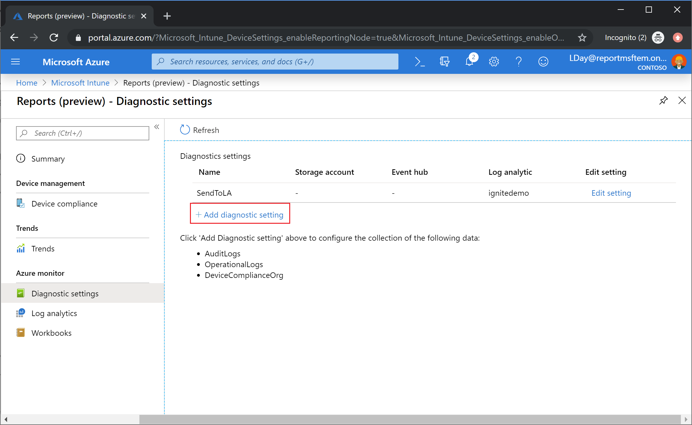

---
# required metadata

title: Microsoft Intune reports
titleSuffix: Microsoft Intune
description: Intune provides specific report types with focused views that contain consistent and timely data. 
keywords:
author: erikre
ms.author: erikre
manager: dougeby
ms.date: 11/10/2019
ms.topic: conceptual
ms.service: microsoft-intune
ms.subservice: fundamentals
ms.localizationpriority: high
ms.assetid: 

# optional metadata

#ROBOTS:
#audience:
#ms.devlang:
ms.suite: ems
#ms.tgt_pltfrm:
ms.custom: intune-azure
ms.collection: M365-identity-device-management
---
# Intune Reports
The Microsoft Intune reports workload provides details about device compliance, device health, and device trends. In addition, you can create custom device reports to obtain more specific data. The information these reports provide will allow you to more effectively and proactively monitor the health and activity of endpoints across your organization. 

> [!NOTE]
> The Intune reporting changes will roll out gradually over a period to help customers prepare and adapt to the new structure.

The report types are organized into the following focus areas:
- **Operational** - Provides timely, focused data that helps you focus and take action on non-compliant devices. Admins, subject matter experts, and helpdesk will find these reports most helpful.
- **Organizational** - Provides a broader summary of the overall device management state. Managers and admins will find these reports most helpful.
- **Historical** - Provides patterns and trends over a period of time. Managers and admins will find these reports most helpful.
- **Specialist** - Allows you to use raw data to create your own custom reports. Admins will find these reports most helpful.

The **Reports** workload provides a consistent and more comprehensive reporting experience. The available reports provide the following functionality:
- **Search and sort** – You can search and sort across every column, no matter how large the dataset.
- **Data paging** – You can scan your data based on paging, either page-by-page or by jumping to a specific page.
- **Performance** - You can quickly generate and view reports created from large tenants.
- **Export** – You can quickly export reporting data generated from large tenants.

### Who can access the data?

Users with the following permissions can review audit logs:

- Global Administrator
- Intune Service Administrator
- Administrators assigned to an Intune role with **Audit data** - **Read** permissions

## Non-compliant devices report (Operational)
Operational reports surface data typically used by Helpdesk or admin roles to identify problems and help remediate issues. The data found in these reports is timely, calls out unexpected behavior, and is meant to be actionable. The report is available alongside the workload, making the operational reports accessible without browsing away from active workflows.

You can view the **Noncompliant devices** report using the following steps:

1. Sign in to [Intune](https://go.microsoft.com/fwlink/?linkid=2090973).
2. Select **Device compliance** > **Noncompliant devices**.

    

For related information, see [Enforce compliance for Microsoft Defender ATP with Conditional Access in Intune](~/protect/advanced-threat-protection.md).

## Device compliance report (Organizational)
Organizational reports are meant to be broad in nature and provide a more traditional reporting view of data to identify aggregated metrics. This report is designed to work with large datasets to get a full device compliance picture. For example, the organizational report for device compliance shows all the compliance states for devices to give a broader view of the data, no matter how large the dataset. This report shows the full breakdown of records in addition to a convenient visualization of aggregated metrics. This report can be generated by applying filters on it and selecting the “Generate report” button. This will refresh the data to show the latest state with the ability to view the individual records that make up the aggregate data. Like most reports in the new framework, these records can be sorted and searched upon to focus on the information you need.

The device compliance report is available as the summary report in the **Reports** workload. Use the following steps to view the device compliance report:

1. Sign in to [Intune](https://go.microsoft.com/fwlink/?linkid=2090973).
2. Select **Reports** to view the reports summary.

    

## Device compliance trend report (Historical)
Historical reports are more likely to be used by admins and architects to identify long term trends for device compliance. The aggregated data is displayed over a period of time, and is useful for making future investment decisions, driving process improvements, or prompting investigation into any anomalies. Filters can also be applied to see specific trends.

For example, a historical report for device compliance trends can show the trend of device compliance states over a period of time. You can identify where compliance peaks occurred and focus your time and effort accordingly.

You can view the **Trends** report using the following steps:

1. Sign in to [Intune](https://go.microsoft.com/fwlink/?linkid=2090973).
2. Select **Reports** > **Trends** to view device compliance over a 60 day trend.

    

## Azure Monitor integration reports (Specialist)
You can customize your own reports to get the data you want. With this, all the data in your reports will be optionally available via [Azure Monitor](https://docs.microsoft.com/azure/azure-monitor/overview) using [Log Analytics](https://docs.microsoft.com/azure/azure-monitor/log-query/log-query-overview) and [Azure Monitor workbooks](https://docs.microsoft.com/azure/azure-monitor/app/usage-workbooks). These solutions allow you to create custom queries, configure alerts and make dashboards to show the device compliance data in a specific way. Additionally, you can retain the activity logs in your Azure storage account, integrated with these reports with [security information and event management (SIEM) tools](https://docs.microsoft.com/microsoft-365/security/office-365-security/siem-server-integration) and correlated them to Azure AD activity logs. This requires an Azure subscription. Azure Monitor workbooks can be used in addition to import dashboards for custom reporting needs.

An example of a specialist report would corelate device ownership data with platform enrollment data in a custom report and display it on an existing dashboard in the Azure Active Directory portal.

You can create and view custom report using the following steps:

1. Sign in to [Intune](https://go.microsoft.com/fwlink/?linkid=2090973).
2. Select **Reports** > **Diagnostic settings** to view or add a diagnostic setting.

    

3. Next, select **Log analytics** to create and run a new query.

   

4. 

## Next steps

Learn more about the following technologies:
- [Azure Monitor](https://docs.microsoft.com/azure/active-directory/reports-monitoring/concept-activity-logs-azure-monitor)