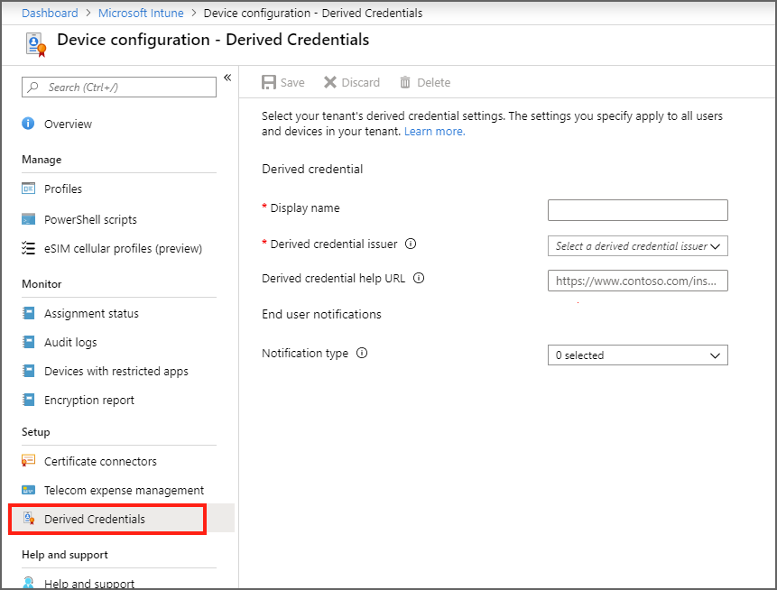

---
# required metadata

title: Use derived credentials for mobile devices in Microsoft Intune - Azure | Microsoft Docs
description: Use derived credentials on mobile devices as an authentication method for Intune VPN, email, Wi-Fi profiles, applications, and S/MIME and encryption. Derived credentials are an implementation of the NIST guidelines for Special Publication 800-157.  
keywords:
author: brenduns
ms.author: brenduns
manager: dougeby
ms.date: 10/19/2019
ms.topic: conceptual
ms.service: microsoft-intune
ms.localizationpriority: high
ms.technology:
ms.assetid:  

# optional metadata

#ROBOTS:
#audience:
#ms.devlang:
ms.reviewer: lacranda
ms.suite: ems
search.appverid: MET150
#ms.tgt_pltfrm:
ms.custom: intune-azure
ms.collection: M365-identity-device-management
---

# Use derived credentials in Microsoft Intune

*This article applies to devices that run iOS*

In an environment where smart cards are required for authentication or encryption and signing, you can now use Intune to provision mobile devices with a certificate that’s derived from a user’s smart card. That certificate is called a *derived credential*. Intune [supports several derived credential issuers](#supported-issuers), though you can use only a single issuer per tenant at a time. 

Derived credentials are an implementation of the National Institute of Standards and Technology (NIST) guidelines for Derived Personal Identity Verification (PIV) credentials as part of Special Publication (SP) 800-157.  

**With Intune’s implementation**:  

- The Intune administrator configures their tenant to work with a supported derived credential issuer. You don’t need to configure any Intune specific settings in the derived credential issuer's system.

- The Intune administrator specifies **Derived credential** as the *authentication method* for the following objects:  

  - Common profile types like Wi-Fi, VPN, and Email, which includes the iOS native mail app 

  - App authentication

  - S/MIME signing and encryption 

- Users obtain a derived credential by using their smart card on a computer to authenticate to the derived credential issuer. The issuer then issues to the mobile device a certificate that’s derived from their smart card. 

- After the device receives the derived credential, it's used for authentication and for S/MIME signing and encryption when apps or resource access profiles require the derived credential. 

<!-- original structure 

## Prepare for derived credentials

Review the following information before you configure your tenant to use derived credentials.

### Supported platforms

Intune supports derived credentials on the following OS platforms:
- iOS/iPadOS
 
### Supported issuers

Intune supports a single derived credential issuer per tenant. You can configure Intune to work with the following issuers:  

- **DISA Purebred**: https://cyber.mil/pki-pke/purebred/ 
- **Entrust Datacard**:  https://www.entrustdatacard.com/
- **Intercede**:  https://www.intercede.com/

> [!IMPORTANT]  
> If you delete the current derived credential issuer from your tenant, the derived credentials that were set up through that issuer will no longer function.  
> 
> See [Change the derived credential issuer](#change-the-derived-credential-issuer) later in this article.   

### Plan for derived credentials

Understand the following considerations before setting up a derived credential issuer.  

#### 1) Review the documentation for your chosen derived credential issuer  

Before you begin configuration of an issuer, review that issuer’s documentation to understand how their system delivers derived credentials to devices. You can only configure a single issuer per tenant at a time, and that issuer is available to all users and supported devices in your tenant.

Your users won't be prompted to enroll for derived credentials until you target them with a policy that requires derived credentials as an authentication method or that uses a derived credential for S/MIME signing and encryption.

#### 2) Review the end-user workflow for your chosen issuer

Before you start configuration of an issuer, understand the tasks that users must complete to receive a derived credential from your chosen issuer.  Then, review Intune policies and configurations to ensure devices and users can successfully obtain a derived credential. 

To request a derived credential for their mobile device, users are guided through a workflow that’s specific to your chosen issuer. To retrieve derived credentials from Intercede and Entrust Datacard, users use the Intune Company Portal app. To retrieve credentials from DISA Purebred, users must also use the DISA Purebred application.  

Common to all issuers is the use of a computer where the user uses their smart card to authenticate themselves to the issuer. Some additional requirements that vary by issuer include:

- Working with an online agent to obtain and enter a series of time-limited passcodes that configure the derived credential. 
- Use of a device camera to scan a QR code that links authentication request to the derived credential request from the mobile device.  

After derived credentials are configured in Intune, users  are notified to begin the derived credential enrollment.  Notification can be through app notification for the Company Portal, through email, or both.  If you choose to use email notifications and you use enabled conditional access, users might not receive the email notification if their device isn’t compliant.

For example, you might use conditional access to block access to email for non-compliant devices. If you rely on email notifications to inform the user to start the derived credential enrollment process, your users might not receive those instructions until they're compliant with policy.

Similarly, some derived credential request workflows require the use of the device camera to scan an on-screen QR code. This code links that device to the authentication request that occurred against the derived credential issuer with the user’s smart card credentials. If device configuration polices block camera use, the user can’t complete the derived credential enrollment request.

User workflow documentation:

- [DISA Purebred](/intune-user-help/) 
- [Entrust Datacard](/intune-user-help/)
- [Intercede](/intune-user-help/)

#### 3) Plan for the end-user apps that are required to request derived credentials

All devices that will enroll for derived credentials must have access to the Intune Company Portal app.

When you use DISA Purebred, users need access to the DISA Purebred app:  

- Use Intune to deploy the DISA Purebred app; a requirement for the app to work with the Company Portal successfully as a managed app.  

- Deploy a [per-app VPN](../configuration/vpn-settings-configure.md) for the DISA Purebred app. 

#### 4) Deploy a trusted root certificate to devices 

A trusted root certificate is used with derived credentials to verify that the derived credential certificate chain is valid and trusted. Even when not directly referenced by policy, a trusted root certificate is required. See [Configure a certificate profile for your devices in Microsoft Intune](certificates-configure.md).

#### 5) Provide end-user instructions for how to get the derived credential 

Create and provide guidance to your users on how to start the derived credential enrollment process and to navigate you the derived credential enrollment workflow for your chosen issuer. 

We recommend you provide a URL that will host your guidance. You specify this URL when you configure the derived credential issuer for your tenant, and that URL is made available from within the Company Portal app. If you don’t specify your own URL, Intune provides a link to generic details. These details can’t cover all scenarios and might not be accurate for your environment. 

#### 6) Deploy Intune policies that require derived credentials 

Create new policies or edit existing policies to use derived credentials. Derived credentials replace other authentication methods for app authentication, Wi-Fi, VPN, email, and for S/MIME signing and encryption.

Avoid requiring use of a derived credential to access a process that you’ll use as part of the process to get the derived credential, as that can prevent users from completing the request. 

END OF ORIGINAL STRUCTURE -->

<!-- Start of NEW STRUCTURE -->

## Prerequisites

Review the following information before you configure your tenant to use derived credentials.

### Supported platforms

Intune supports derived credentials on the following OS platforms:
- iOS/iPadOS
 
### Supported issuers

Intune supports a single derived credential issuer per tenant. You can configure Intune to work with the following issuers:  

- **DISA Purebred**: https://cyber.mil/pki-pke/purebred/ 
- **Entrust Datacard**: https://www.entrustdatacard.com/
- **Intercede**: https://www.intercede.com/

For important details about using the different issuers, review guidance for that issuer, including the issuers end-user workflow. For more information, see [Plan for derived credentials](plan-for-derived-credentials) in this article.

> [!IMPORTANT]  
> If you delete a derived credential issuer from your tenant, the derived credentials that were set up through that issuer will no longer function.  
> 
> See [Change the derived credential issuer](#change-the-derived-credential-issuer) later in this article.   

## Plan for derived credentials

Understand the following considerations before setting up a derived credential issuer.  

### 1) Review the documentation for your chosen derived credential issuer  

Before you configure an issuer, review that issuer’s documentation to understand how their system delivers derived credentials to devices. The different issuers can have different requirements. 

Review your Intune configurations to ensure they don't block access that's necessary for devices or users to complete the credential request.  

For example, you might use conditional access to block access to email for non-compliant devices. If you rely on email notifications to inform the user to start the derived credential enrollment process, your users might not receive those instructions until they're compliant with policy.  

Similarly, some derived credential request workflows require the use of the device camera to scan an on-screen QR code. This code links that device to the authentication request that occurred against the derived credential issuer with the user’s smart card credentials. If device configuration polices block camera use, the user can’t complete the derived credential enrollment request.  

General information:  

- You can only configure a single issuer per tenant at a time, and that issuer is available to all users and supported devices in your tenant.

- Device users won't be notified that they must enroll for derived credentials until you target them with a policy that requires a derived credential as the authentication method or that uses a derived credential for S/MIME signing and encryption.

- Notification can be through app notification for the Company Portal, through email, or both. If you use conditional access policies and choose only email notifications, users might not receive the notification if their device isn’t compliant.

### 2) Review the end-user workflow for your chosen issuer

Following are key considerations for each supported partner, and links to that issuers end-user workflow.  Become familiar with this information so you can ensure your Intune policies and configurations don’t block users and devices from completing enrollment for a derived credential.

#### DISA Purebred

Review the [user workflow for DISA Purebred](https://review.docs.microsoft.com/intune-user-help/). Key requirements for this workflow include:  

- Users need access to a computer or KIOSK where they can use their smart card to authenticate to the issuer. 

- Devices that will enroll for a derived credential must install the Intune Company Portal app.

- Use Intune to [deploy the DISA Purebred app](#deploy-the-disa-purebred-app) to devices that will enroll for a derived credential. This app must be deployed through Intune so that it’s managed and can work with the Intune Company Portal app. Users must use this app to complete the derived credential request from DISA Purebred. 

- The DISA Purebred app requires a [per-app VPN](../configuration/vpn-settings-configure.md) to ensure the app can access DISA Purebred during enrollment for the derived credential. 

- When requesting a credential for DISA Purebred, users communicate with a live agent to get a series of time-limited one-time passcodes as they work through the enrollment process.  

#### Entrust Datacard  
Review the [user workflow for Entrust Datacard](https://review.docs.microsoft.com/intune-user-help/). Key requirements for this workflow include: 

- Users need access to a computer or KIOSK where they can use their smart card to authenticate to the issuer. 

- Devices that will enroll for a derived credential must install the Intune Company Portal app.

- Use of a device camera to scan a QR code that links the authentication request to the derived credential request from the mobile device.

#### Intercede
Review the [user workflow for Intercede](https://review.docs.microsoft.com/intune-user-help/). Key requirements for this workflow include: 

- Users need access to a computer or KIOSK where they can use their smart card to authenticate to the issuer. 

- Devices that will enroll for a derived credential must install the Intune Company Portal app.

- Use of a device camera to scan a QR code that links the authentication request to the derived credential request from the mobile device.

### 3) Deploy a trusted root certificate to devices 

A trusted root certificate is used with derived credentials to verify that the derived credential certificate chain is valid and trusted. Even when not directly referenced by policy, a trusted root certificate is required. See [Configure a certificate profile for your devices in Microsoft Intune](certificates-configure.md).

### 4) Provide end-user instructions for how to get the derived credential 

Specific to your organization, draft custom guidance for your users on how to start the enrollment process and to navigate the enrollment workflow. 

We recommend you provide a URL that will host your guidance. You specify this URL when configuring the derived credential issuer for your tenant. The URL is made available to users from within the Company Portal app. If you don’t specify your own URL, Intune provides a link to generic details. These details can’t cover all scenarios and might not be accurate for your environment. 

### 5) Deploy Intune policies that require derived credentials 

Create new policies or edit existing policies to use derived credentials. Derived credentials can replace other authentication methods for app authentication, Wi-Fi, VPN, email, and for S/MIME signing and encryption.

Remember to avoid requiring a derived credential to access a process that you’ll use as part of the process to get the derived credential.  

<!--  END OF NEW STRUCTURE -->

## Set up a derived credential issuer

Before you create policies that require use of a derived credential, set up a credential issuer in the Intune console. A derived credential issuer is a tenant-wide setting. Tenants support only a single issuer at a time. 

1. Sign in to [Intune](https://go.microsoft.com/fwlink/?linkid=2090973) and go to **Device Configuration** > **Derived Credentials**.  

      

2. Specify a friendly **Display name** for the derived credential issuer policy.  This name isn’t shown to your device users.

3. For **Derived credential issuer**, select the derived credential issuer that you have chosen for your tenant:
   - DISA Purebred
   - Entrust Datacard
   - Intercede  

4. Specify a **Derived credential help URL** to provide a link to a location that includes custom instructions to help users get derived credentials for your organization. The instructions should be specific to your organization and to the workflow that's necessary to get a credential from your chosen issuer. The link appears in the Company Portal app. 

   If you don’t specify your own URL, Intune provides a link to generic details that can’t cover all scenarios. This generic guidance might not be accurate for your environment.

5. Select one or more options for **Notification type**. Notification types are the methods you use to inform users that they must use the Company Portal app to get or update derived credentials for the following scenarios:

   - Enroll a device with an issuer to get a new derived credential.
   - Get a new derived credential when the current credential is close to expiration. 
   - Use a derived credential with a policy for Wi-Fi, VPN, email, or app authentication, and for S/MIME signing and encryption. 

6. When ready, select **Save** to complete configuration of the derived credential issuer. 

After you save the configuration, you can make changes to all fields except for the *Derived credential issuer*.  To change the issuer, see [Change the derived credential issuer](#change-the-derived-credential-issuer). 

## Deploy the DISA Purebred app

*This section applies only when you use DISA Purebred*.

To use **DISA Purebred** as your derived credential issuer for Intune, you must get the DISA Purebred app and then use Intune to deploy the app to devices. Device users must use the app on their device to request the derived credential from DISA Purebred.  
  
In addition to the deploying the app with Intune, configure an Intune per-app VPN for the DISA Purebred application.

**Complete the following tasks**: 
  
1. Download the [DISA Purebred application](https://cyber.mil/pki-pke/purebred/).
2. Deploy the DISA Purebred application in Intune.  See [Add an iOS line-of-business app to Microsoft Intune](../apps/lob-apps-ios.md).
3. [Create a per-app VPN](../configuration/vpn-settings-configure.md) for the DISA Purebred application.
4. Deploy the Company Portal app from the App store.  See [Add iOS store apps to Microsoft Intune](../apps/store-apps-ios.md).
 

## Use derived credentials for authentication and S/MIME signing and encryption

You can specify **Derived credential** for the following profile types and purposes:  
- [Applications](#use-derived-credentials-for-app-authentication)
- [Email](../configuration/email-settings-ios.md)
- [VPN](../configuration/vpn-settings-ios.md)
- [S/MIME signing and encryption](certificates-s-mime-encryption-sign.md)
- [Wi-Fi](../configuration/wi-fi-settings-ios.md)

  For Wi-Fi profiles, *Authentication method* is available only when the **EAP type** is set to one of the following values: 
  - EAP – TLS
  - EAP-TTLS
  - PEAP

### Use derived credentials for app authentication

Use derived credentials for certificate-based authentication to web sites and applications. To deliver a derived credential for app authentication, do the following steps in the Intune console:  

1. Sign in to [Intune](https://go.microsoft.com/fwlink/?linkid=2090973) and go to **Device Configuration** > **Profiles** and select **Create Profile**.

2. Enter a friendly name for the profile under **Name**.

3. For **Platform**, select **iOS**.

4. For **Profile type**, select **Derived credential**.

5. Select **OK** and then click **Create**.

6. Select **Assignments** to choose which groups should receive the policy.
 
Users receive the app or email notification depending on the settings you specified when you set up the derived credential issuer. The notification informs the user to launch the Company Portal so that the derived credential policies can be processed.

## Renew a derived credential

Derived credentials can't be extended or renewed. Instead, users must use the credential request workflow to request a new derived credential for their device.

If you configure one or more methods for **Notification type** for your issuer, users are automatically notified when their current derived credential reaches 80% of its life span. The notification directs users to go through the credential request process to get a new derived credential. 

After a device receives a new derived credential, policies that use derived credentials redeploy to that device. 

## Change the derived credential issuer

At the tenant level, you can change your credential issuer, although only one issuer is supported for a tenant at a time. 

After you change the issuer, users are prompted to get a new derived credential from the new issuer. They must do so before they can use a derived credential for authentication.

### Change the issuer for your tenant
> [!IMPORTANT]  
> If you delete an issuer and immediately reconfigure that same issuer, you must still update profiles and devices to use derived credentials from that issuer. Derived credentials that were obtained before you delete the issuer are no longer valid. 

1. Sign in to [Intune](https://go.microsoft.com/fwlink/?linkid=2090973) and go to **Device Configuration** > **Derived Credentials**.

2. Select **Delete** to remove the current derived credential issuer.

3. Configure a new issuer. 

### Update profiles that use derived credentials

After you delete an issuer and then add a new one, even if it’s the same issuer, edit each profile that uses derived credentials. Any edit of the profile will trigger an update, including a simple edit to the profile *Description*.

### Update derived credentials on devices

After you delete an issuer and then add a new one, device users must request a new derived credential. This rule applies even when you add the same issuer that you removed. The process to request the new derived credential is the same as for enrolling a new device or renewing an existing credential. 

## Next steps

[Create device configuration profiles](../configuration/device-profile-create.md)

 